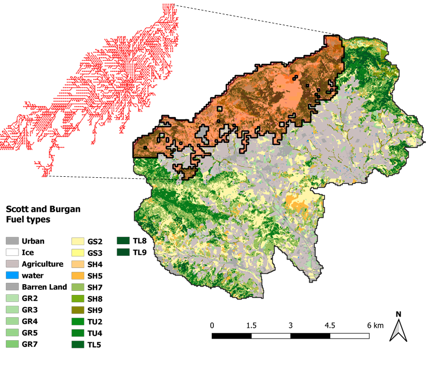

# Cell2Fire W
A big-scale, grid, forest fire simulator; parallel and fast (c++) nevertheless with a friendly graphical user interface for QGIS.

_Originally forked from Cell2Fire, thanks to the work of Cristobal Pais, Jaime Carrasco, David Martell, [David L. Woodruff](https://github.com/DLWoodruff), Andres Weintraub, et al._

This fire spread simulator, supports 3 fire models:
* Kitral, formerly: [C2F+K](https://github.com/fire2a/C2FK)
* Scott&Burgan, formerly [C2F+S&B](https://github.com/fire2a/C2FSB) 
* Canadian Forest Fire Behavior Prediction System, OG [Cell2Fire](https://github.com/cell2fire/Cell2Fire)
  
As Cell2Fire: i) the landscape is characterized as a grid, in which every cell has the same size, and the necessary information to simulate fire spread, i.e. fuel type, elevation and ignition probability, among others; ii) exploits parallel computation methods which allows users to run large-scale simulations in short periods of time; iii) the fires spread within each cell is assumed to be elliptical; and iv) it includes powerful statistical, graphical output, and spatial analysis features to facilitate the display and analysis of projected fire growth.

Installation, usage, specifications available by [reading the friendly manual here](https://fire2a.github.io/docs/). 

[O leyendo el manual acá](https://fire2a.github.io/documentacion/)

# Usage (TL;DR)

- Easy: Use through QGIS GUI
- Moderate: Download a release, unzip, and run the CLI
- Collaborative: Clone & [compile](https://fire2a.github.io/docs/docs/Cell2Fire/README.html)

# Output examples
## Previncat's Zone 60 (Catalonian Instance): forest and a simulated fire spread with its corresponding scar and growth propagation tree. 

## Risk metrics: Burn Probability (BP), Betweenness Centrality (BC), Downstream Protection Value (DPV), and Growth Propagation Tree (GPT). 


## Easy: Graphical User Interface for QGIS
1. Install QGIS >= LTR version
2. Add [this](https://fire2a.github.io/fire-analytics-qgis-processing-toolbox-plugin/plugins.xml) as plugin server repo in QGIS
3. Pip install python dependendiencies to use other related algorithms such as risk metrics and landscape decision optimization
4. Install the plugin from the QGIS plugin manager
5. Use the plugin from the processing toolbox: Use the instance downloader to get ready instance, and then simulate your first wildfire!

Full guide, how to [fire2a.io/docs](https://fire2a.github.io/docs/)
Plugin repo: [fire2a/fire-analytics-qgis-processing-toolbox-plugin](https://github.com/fire2a/fire-analytics-qgis-processing-toolbox-plugin) repo

## Moderate: CLI 
Go to releases (right vertical tab bar):
1. Download the latest (not-draft) version (Cell2FireW_v<X.Y.Z>.zip)
2. Download a prepared instance, choosing:
   - fuel model: Kitral, Scott&Burgan, or Canada (--sim <K|S|C>)
   - raster format: tif or asc
3. Open a terminal, type the following:
```bash
# needs an empty directory to store the results
mkdir results 

# locate your binary
cd C2F-W/Cell2Fire/

# run idea
./Cell2Fire[.exe|Linux.x86-64|Darwin.[x86-64|arm64]] --input-instance-folder </path/to/instance> --output-folder </path/to/empty/results> --sim <K|S|C> --nthreads 16 > log.txt

# sample
./Cell2Fire.Linux.x86_64 --final-grid --output-messages --out-ros --sim S --nsims 2 --seed 123 --nthreads 3 --fmc 66 --scenario 2 --cros --weather rows --input-instance-folder /tmp/processing_cdcCGk/Vilopriu_2013 --output-folder /tmp/processing_cdcCGk/Vilopriu_2013/results | tee log.txt

# note: binaries are named like this:
ext=`python3 -c "import platform;print(f'.{platform.system()}.{platform.machine()}')"`
mv Cell2Fire Cell2Fire$ext
```
## Collaborative: compile it
```bash
# dependencies
sudo apt install g++-12 libboost-all-dev libeigen3-dev libtiff-dev

git clone
cd C2F-W/Cell2Fire

# choose your makefile with the option flag: -f makefile.<platform>
make 
sudo make install  # optional: copies Cell2Fire to /usr/local/bin

git switch -c my-feature
```
Other platform details at `.github/workflows/build\*.yml`
